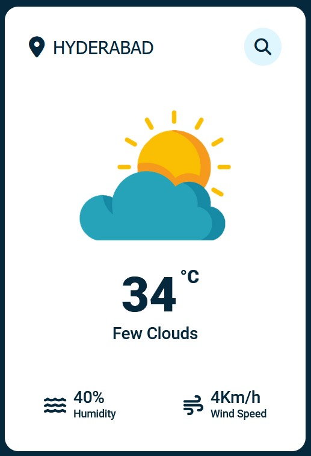

<<<<<<< HEAD
# Weather App

This project can fetch weather details of a location. Data from openweathermap.org

# Screenshot

This is how it looks :

=======
# Weather-App
Weather App
>>>>>>> origin/main
